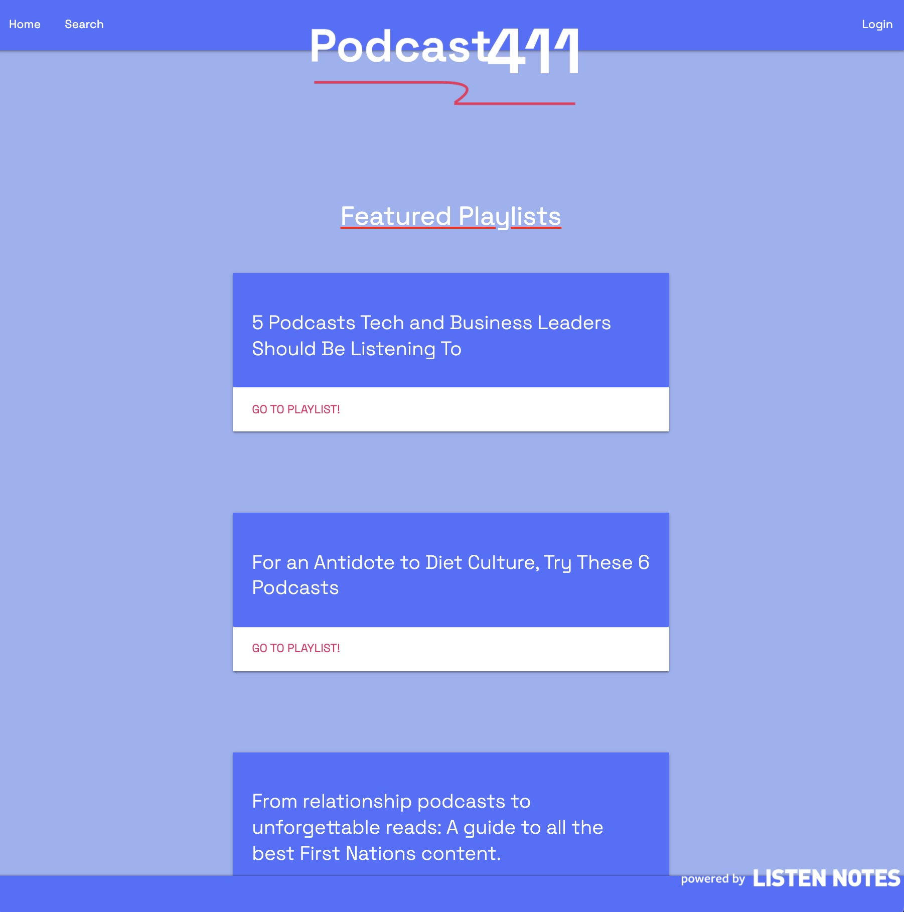

# Podcast411

## Description

Podcast411 is your go-to site to find your new favorite podcast! Powered by Listen Notes, users can view weekly curated lists or search for podcasts by keyword. Create an account today to save your favorite podcasts!

## Table of Contents

- [Usage](#usage)
- [Visual](#visual) 
- [Credits](#credits)
- [Links](#links)

## Usage

Podcast 411 is wonderful for searching podcasts or curated playlists, however, create an account to save those podcasts to your profile to view over and over to your hearts content!

## Visuals

## Credits

- [Ray Hewitt](https://github.com/Rayman244) - API Master
- [Maximilian Stump](https://github.com/MaxStump13) - API Master
- [Katelynn McCann](https://github.com/katelynndonahue) - Presentation Queen

## Links

- GitHub Repository
    - https://github.com/giovannaruggio/Podcast411
    

- Heroku Deployed Link
    - https://podcast-411-app.herokuapp.com/

